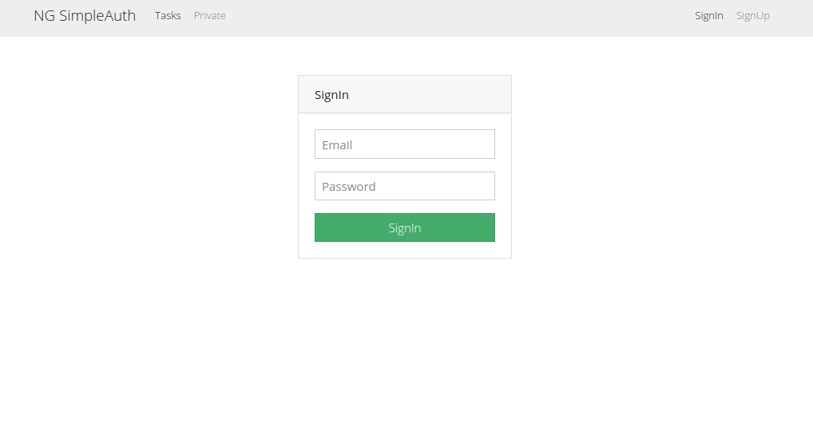

# Angular & Nodejs JWT Auth




### Modules on Backend

```javascript
npm i express mongoose cors jsonwebtoken
npm install nodemon -D
//Check package.json for more information
npm run dev

npm i dotenv
``` 

### Modules on Angular Frontend

```
ng new angular-front --routing
ng generate component components/signup
ng generate component components/signin
ng generate component components/tasks
ng generate component components/private-tasks
ng generate service services/auth
ng generate service services/tasks
ng generate service services/token-interceptor
//Generate Guard, permite los accesos de los usuarios
ng g g auth
//Start app
ng serve
``` 